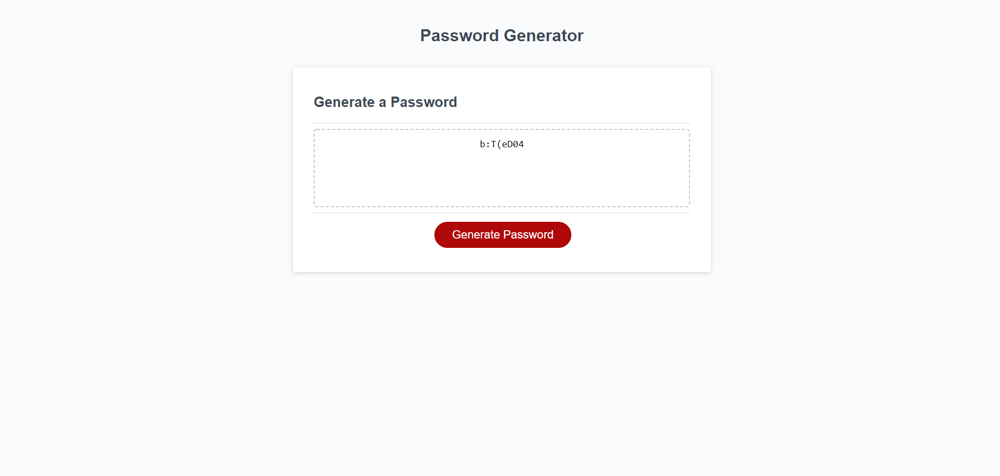

# hw3

# 03 JavaScript: Password Generator

# Description

Below you will find links to my password generator application.

When user clicks the button to generate a password
Then the user is presented with a series of prompts for password criteria
Then the user selects which criteria to include in the password
When prompted for the length of the password
Then the user will choose a length of at least 8 characters and no more than 128 characters
When asked for character types to include in the password
Then the user confirms whether or not to include lowercase, uppercase, numeric, and/or special characters
When the user answers each prompt
Then the users' input should be validated and at least one character type should be selected
When all prompts are answered
Then a password is generated that matches the selected criteria
When the password is generated
Then the password is written to the page

## screenshot

Here is the repo:[mhaddadin1/repo](https://github.com/mhaddadin1/hw3)

Here is the page:[mhaddadin1/pages](https://mhaddadin1.github.io/hw3/)
